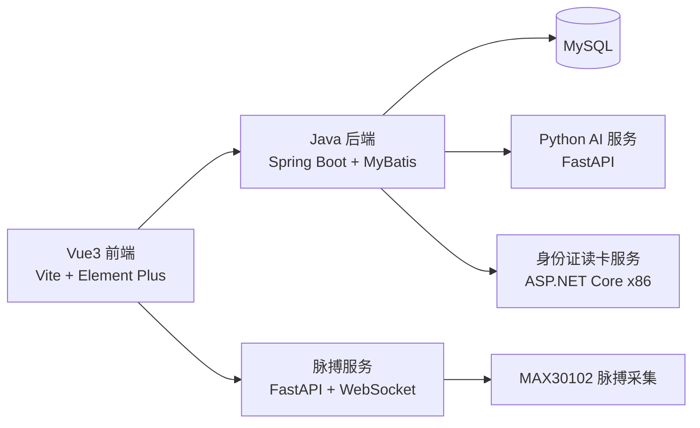
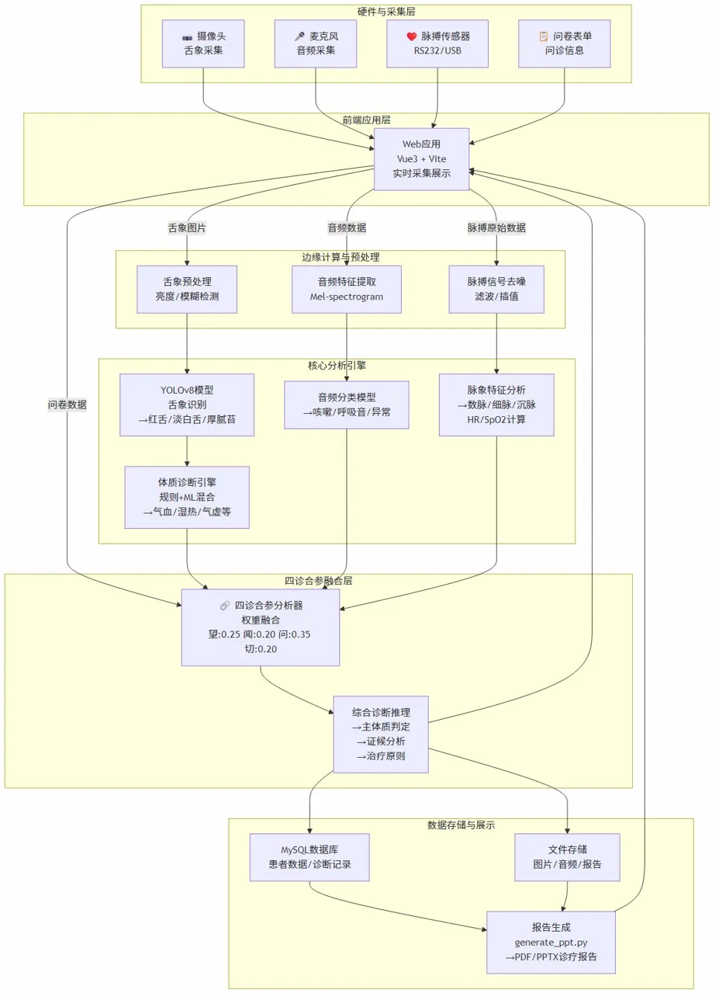
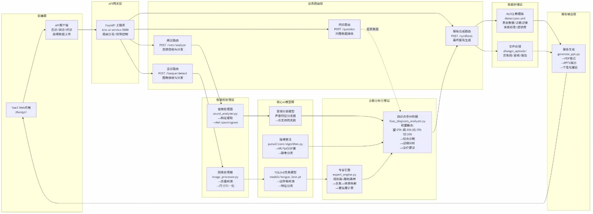
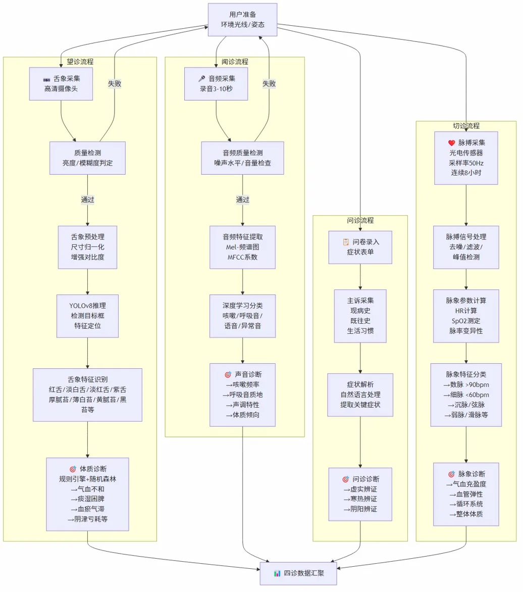

# 中医智慧诊疗系统（四诊合参 + AI）

> 一个面向社区卫生/中医门诊/健康管理场景的中医体质辨识系统。  
> 支持 **望诊（舌象）/闻诊（音频）/问诊（问卷）/切诊（脉搏）**，并生成可导出的综合报告。

## ✨ 核心能力

- **四诊融合**：望闻问切可分步采集，支持 1~4 板块任意组合生成阶段报告。
- **AI 报告生成**：支持普通生成与 SSE 流式生成，支持“望/闻/问/切”侧重模式与自定义提示词。
- **患者全流程**：患者登记 → 诊断会话创建 → 四诊采集 → 报告生成 → 档案管理。
- **管理后台**：管理员登录、患者管理、诊断记录管理、体质统计分析。
- **居民体检模块**：完整体检字段管理（生命体征、生化、影像、医生建议等）。
- **软件模式 / 硬件模式双形态**：
  - 软件模式：三诊（望/闻/问），适合演示与快速部署；
  - 硬件模式：可接入脉诊设备与身份证读卡服务。

---

## 🧭 系统架构



### 📊 架构与流程图







---

## 🧩 功能模块总览

| 模块 | 主要功能 | 关键接口/页面 |
|---|---|---|
| 患者登记 | 身份证号去重更新、可选身份证读卡填充 | `/api/user/save`、`PatientRegister.vue` |
| 望诊 | 舌象图片采集、视觉模型分析、雷达图返回 | `/api/detect/wang` → Python `/tongue/detect` |
| 闻诊 | 浏览器录音、声学特征提取、体质标签输出 | `/api/wen/analyze` → Python `/wen/analyze` |
| 问诊 | 原始问卷 + 多专项模板（高血压/糖尿病/儿童/五态人格） | `/api/tcm/submit` |
| 切诊 | WebSocket 实时波形、HR/SpO2/脉象标签、质量门控 | `pulse2:/ws/pulse`、`/api/pulse/start`、`/api/pulse/stop`、`/api/detect/qie/save` |
| 报告中心 | 普通+流式报告生成、分板块 completedTypes、focusMode、自定义提示词 | `/api/report/generate`、`/api/report/generate/stream` |
| 档案管理 | 诊断记录分页、患者关联查询、详情查看 | `/api/admin/diagnoses-with-patient` |
| 体检管理 | 体检档案增删改查、身份证检索、报告页查看 | `/api/health-exam/*` |
| 管理后台 | JWT 登录、患者删除（级联诊断）、统计概览 | `/api/admin/*` |
| 身份证服务（可选） | 本地 x86 读卡服务转接 | `/api/idcard/*` |

---

## 🗂️ 项目结构

```text
.
├─Vue/zhongyi/                 # 前端（Vue3 + Vite）
├─demo/                        # Java 后端（Spring Boot）
├─tcm-ai-service/              # AI 服务（FastAPI）
├─pulse2/                      # 脉搏采集与算法服务（FastAPI + WS）
├─IdCardReaderService/         # 身份证读卡服务（.NET 6 x86）
├─docker-compose.software.yml  # 软件模式一键部署
├─start_tcm.bat / start.vbs    # 本地启动脚本
└─mysql/                       # MySQL 初始化目录（compose 挂载）
```

---

## 🚀 快速开始

## 1) 软件模式（推荐，最快）

软件模式会关闭身份证读卡与切诊硬件，仅保留三诊流程（望/闻/问）。

```bash
cp .env.software.example .env
docker compose -f docker-compose.software.yml up -d --build
```

默认访问：`http://localhost`（可通过 `WEB_PORT` 调整）。

## 2) 本地开发模式（完整能力）

### 后端（Java）

```bash
cd demo
mvn spring-boot:run
```

### AI 服务（Python）

```bash
cd tcm-ai-service
pip install -r requirements.txt
python main.py
```

### 前端（Vue）

```bash
cd Vue/zhongyi
npm install
npm run dev
```

### 可选：切诊服务

```bash
cd pulse2
python main.py
```

### 可选：身份证读卡服务

见 `IdCardReaderService/README.md`（Windows x86 / .NET 6）。

---

## ⚙️ 关键环境变量

| 变量 | 说明 |
|---|---|
| `MYSQL_ROOT_PASSWORD` | MySQL root 密码 |
| `MYSQL_DATABASE` | 数据库名（默认 `zhongyi`） |
| `JWT_SECRET` | 管理后台 JWT 密钥 |
| `GLM_API_KEY` | 报告合成大模型 Key |
| `GLM_BASE_URL` | 报告模型网关地址 |
| `QWEN_API_KEY` | 舌象视觉模型 Key |
| `QWEN_BASE_URL` | 视觉模型网关地址 |
| `QWEN_VISION_MODEL` | 舌诊视觉模型名称 |
| `WEB_PORT` | 前端对外端口 |

> ⚠️ 请勿把真实密钥提交到公开仓库；部署前务必替换示例配置。

---

## 🔌 后端接口（按域）

### 诊断与报告

- `POST /api/diagnosis/session/start`：创建诊断会话（caseId）
- `POST /api/detect/wang`：望诊
- `POST /api/wen/analyze`：闻诊
- `POST /api/tcm/submit`：问诊提交
- `POST /api/tcm/reset-wen`：清空问诊结果
- `POST /api/detect/qie/save`：切诊结果写回
- `POST /api/report/generate`：生成报告
- `POST /api/report/generate/stream`：流式生成报告
- `GET /api/report/get-diagnosis`：读取当前诊断数据

### 患者与体检

- `POST /api/user/save`：患者新增/更新（按身份证）
- `POST /api/health-exam/save` / `PUT /api/health-exam/update/{id}`
- `GET /api/health-exam/{id}` / `GET /api/health-exam/list`
- `GET /api/health-exam/search?idCard=...`
- `DELETE /api/health-exam/{id}`

### 管理后台

- `POST /api/admin/login`
- `GET /api/admin/stats`
- `GET /api/admin/patients`
- `DELETE /api/admin/patient/{id}`
- `GET /api/admin/diagnoses`
- `GET /api/admin/diagnoses-with-patient`
- `GET /api/admin/constitution-stats`

### 身份证读卡（可选）

- `GET /api/idcard/read`
- `GET /api/idcard/status`
- `GET /api/idcard/health`
- `POST /api/idcard/release`

---

## 🧠 算法与实现要点

- **望诊**：图像质量校验（亮度/清晰度）→ 视觉大模型结构化打分 → 雷达图返回。
- **闻诊**：MFCC + F0 + Jitter/Shimmer/HNR 等声学特征融合，输出体质倾向与置信度。
- **问诊**：支持国家标准体质问卷与专项模板，自动计算主次体质候选。
- **切诊**：50Hz 波形采样 + 算法窗口分析 + 质量判定，低质量测量会拒绝出报告。
- **报告生成**：将四诊数据统一为结构化上下文，调用 LLM 生成中文 Markdown 报告。

---

## 📌 部署形态建议

- **演示/培训**：使用 `docker-compose.software.yml`（最省心）。
- **门诊硬件接入**：本地开发模式 + `pulse2` + `IdCardReaderService`。
- **生产建议**：拆分密钥、最小化开放端口、后端/AI 服务加网关与鉴权。

---

## ⚠️ 医疗免责声明

本系统用于中医健康管理与辅助分析，输出结果不替代临床诊断。涉及疾病诊断、处方与治疗请由专业医师决策。
